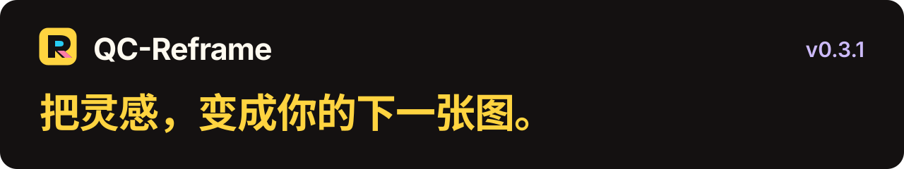

**选一张参考图，用你的 Codex 细查逆向，再直接生成图片。**

在浏览器里收集灵感，在本机工作台调整主体、提示词与结果。沿用 Codex 登录和额度，无需另外填写模型 API Key。

**[开始使用 ↗](browser-extension/docs/INSTALL_WITH_CODEX.md#让-codex-帮你安装)**　·　[下载 v0.4.0](https://github.com/AIDiscovery007/qc-reframe/releases/tag/v0.4.0)　·　[效果画廊](browser-extension/docs/gallery/README.md)　·　[使用手册](browser-extension/README.md)

## v0.4.0，让会话里的故事成为画面

选择一张风格参考图，再从本机 Codex 会话中挑选创作素材。标题搜索与可重建的本地正文索引帮助找到内容，已选会话始终置顶；人物描述更具体，CLI 安装、兼容检查、升级和失败恢复也在现有设置中贯通。

本次升级需更新完整仓库并重启本机服务，再重载扩展、刷新工作台和网页；已有项目、历史结果与配对保留。

[查看 v0.4.0 更新与升级说明 →](browser-extension/docs/releases/v0.4.0.md)

## 工作台，让画面成为主角

*此图为 v0.2.0 的历史界面预览，使用已公开的[水彩陶瓷杯案例](browser-extension/docs/gallery/watercolor-mug/README.md)，不执行模型调用。*

图片完整适应固定画布，图条切换主体与参考。逆向路径、图片操作和提示词版本集中在下方工具栏；生成结果在另一侧展开，便于对照和继续创作。

**提示词，需要时展开。** 中英文、复制、编辑、导出和目标尺寸都在内容旁；收起后把空间还给画布。拖动横条可回弹或收起，也支持按钮、键盘和减少动态效果。

<strong>展开查看：提示词面板与目标尺寸</strong>

*同一 v0.2.0 示例工作台的展开状态。提示词版本、输入草稿与生成历史分别保留。*

## 随手开始，随时接回工作台

网页悬浮面板与工具栏弹窗采用相同的画布、图条和紧凑操作。上传、互换、逆向、复制和快捷生图留在手边；复杂编辑、多图编排、尺寸设置与历史管理，进入工作台继续。

  
  &nbsp;
  

*左：工具栏弹窗。右：网页悬浮面板。均为 v0.2.0 构建与公开素材的历史示例预览；窄屏按顺序阅读。*

打开工作台时，**当前项目、模式、提示词版本与未提交输入一起接续**。关闭面板不取消已提交任务，多个项目可并行推进。

## 保留你的主体，演绎参考的画面

| 你的主体 | 参考模板 | 实际生成 |
| :---: | :---: | :---: |
|  |  |  |

**[都市海报 · 查看完整 Prompt →](browser-extension/docs/gallery/urban-poster/README.md)**　通过插件逆向并调用 Codex imagegen 生成的公开案例，不是本次界面预览合成的效果。

更多案例：[水彩肖像](browser-extension/docs/gallery/watercolor-portrait/README.md) · [水彩陶瓷杯](browser-extension/docs/gallery/watercolor-mug/README.md) · [完整画廊](browser-extension/docs/gallery/README.md)

四条图像路径按意图分工：**提取风格**保留主体结构、迁移画法；**完整复刻**把参考变成可执行文字；**主体重演**保留身份、重演画面；**多图重演**编排 2–6 张主体与参考模板。新增的**会话创作**以参考图提供风格、所选 Codex 会话提供人物与故事内容。

内置 Alchemy skill 从整图定位、局部放大到细节核查，关注人物神态、微动作与整体氛围。提示词、图片和项目留在本机，可继续编辑与生成。[了解更多能力 →](browser-extension/docs/FEATURES.md)

## 开始你的第一张图

**[把安装交给 Codex →](browser-extension/docs/INSTALL_WITH_CODEX.md#让-codex-帮你安装)**　复制安装指令，完成环境检查、本机服务启动与浏览器配对；同页也有手动安装和升级步骤。

需要已登录的 Codex CLI、Node.js 22.15+ 和可加载 MV3 扩展的浏览器。Codex 内置浏览器已有使用验证，也保留 Chrome 路径；生图需账户支持内置生图能力。**首次安装需要完整仓库，Chrome ZIP 仅含浏览器端。**

[安装与排错](browser-extension/docs/INSTALL_WITH_CODEX.md) · [功能导览](browser-extension/docs/FEATURES.md) · [版本变化](browser-extension/docs/releases/README.md) · [贡献指南](Contribution.md)

本机保存不代表离线推理；选中的图片，以及会话创作中所选会话的用户文本和助手最终回复，会按你的 Codex 配置交给模型。逆向用于近似复刻与风格迁移，不保证恢复原始 Prompt。[数据与使用边界 →](browser-extension/README.md#图片与数据)
