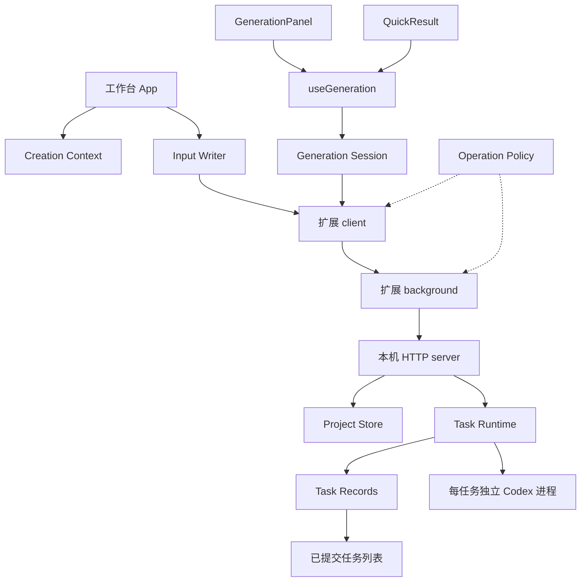

# Reframe 架构与维护边界

Reframe 保持扩展 UI、扩展后台、本机 bridge 三个执行环境。共享业务规则集中在明确的 module 中，界面保留导航、布局与效果，HTTP 入口保留鉴权、参数解析与执行装配。领域词汇见 [GLOSSARY.md](../../GLOSSARY.md)，产品约束见 [AGENTS.md](../AGENTS.md)。

## 创作上下文

`lib/creation-context.ts` 的 interface 包括 reducer、上下文解析、快捷草稿过滤和输入 writer。它集中保存此前散落在 App 闭包中的优先级与失效规则，减少跨函数追踪状态的成本。

- 草稿以 `projectId:mode:version` 隔离，优先于对应当前输入与历史快照。当前输入仅用于当前版本或尚未逆向的输入；历史版本使用当次参考图，缺图不回退到别的版本。
- 外部较新 `inputRevision` 使项目工作输入草稿失效；本地保存只清理对应当前草稿，保留历史草稿。提示词正文编辑继续由独立草稿管理。
- `createInputWriter` 同步防重入，发送输入 revision，并在响应到达时核对上下文对象身份和导航 revision。检查通过与 commit 回调在同一段同步执行中完成，不能在两者间再插入 `await`。
- writer 丢弃旧响应只影响界面接收。服务端可能已经成功保存；后续重新读取项目按服务端 revision 恢复，不伪造撤销。

App 仍拥有页面导航、提醒、弹层、轮询和效果，不把所有 UI 状态塞入领域 reducer。QuickWorkspace 沿用自己的初始化与交接编排，输入草稿过滤复用同一规则。

## 共享生图行为

`lib/generation-session.ts` 提供 `generationReadiness` 和 `createGenerationSession`；`lib/use-generation.ts` 是 React adapter。工作台和快捷结果共用资格判断、提交参数、取消、同步防重入、失败状态、图片及参考快照读取。

每个挂载中的提示词版本有自己的生图会话。图片读取用序号丢弃迟到结果；版本离开后不再更新其展示，但已经提交的请求仍通过原版本 onUpdate 更新数据、onRequestState 收尾原抽屉。清理当前历史图片定位属于独立 onViewUpdate，仅允许原挂载生命周期、创作上下文及导航轮次仍有效时执行，离开再返回也不能接收旧请求的视图动作。关闭界面不取消本机任务。实际布局、抽屉、语言、尺寸控件与图片操作留在各自组件中。

这个 seam 有两个实际 UI adapter，改动一处即可覆盖两端；不引入通用表单框架或全局事件总线。

## 运行与持久化

`bridge/task-runtime.mjs` 统一逆向和生图的执行占用及完成路径。`reserve` 为每个任务保留独立 AbortController；`cancel` 标记取消、发出信号并保存，直到 `run` 的最终保存结束才释放占用。跨项目并行不共享取消信号。读取占用和运行占用都参与维护操作的忙碌判断。

`bridge/task-records.mjs` 拥有任务 JSON 的加载、提交与恢复：

1. 调用 save 时冻结 JSON 快照，串行写临时文件，再原子 rename。
2. rename 成功后执行 onCommit，任务 feed 使用已提交快照；项目索引可用实时进度做摘要失效。
3. 最近保存时间（含完成保存）写在任务的 `updatedAt`，项目摘要兼容旧记录的 `createdAt`。任务完成不再依赖第二次项目元数据 touch，避免任务已落盘而 feed 未发布的部分成功状态。
4. 重启时将中断的逆向及生图先保存为失败，再对外发布；恢复保存失败会中止启动。损坏记录不会掩盖其他可恢复任务，图片回收仍保守阻断。
5. 未提交保存存在时 `canCollect` 为 false，防止回收尚待写入引用的资源。保存恢复成功后才允许回收；执行终态保存失败会报告保存失败并重试记录。

这是单机进程中的有序提交，不声称提供跨文件数据库事务或断电级 fsync 保证。项目编辑继续使用既有原子 JSON 与删除 journal；输入 CAS 在 Project Store 编辑队列内部再次校验，避免排队前两次校验都通过。项目、图片与任务记录各自已有的恢复方式保持兼容。

## 通信与预览

`lib/operation-policy.ts` 是 UI 请求来源和 transport 的共同目录，供 client、background、bridge 超时与 preview 使用。慢输入请求和会话请求使用 port，后台仍验证扩展 ID、URL、frame 及具体消息参数；会话读取仅允许扩展页面。为了旧页面兼容，保留允许操作的单次消息处理及 callback 响应。

[`agent-tool/preview.mjs`](../../agent-tool/preview.mjs) 是示例 adapter，运行实际构建的 UI，模拟外部环境。它复用请求目录，正文索引损坏时标题搜索回退与生产模块有契约测试。它仍模拟任务、图片和项目写入，不是第二个生产存储实现，也不能证明真实扩展权限、跨域取图或模型调用可用。

## 测试与修改路径

先在插件目录执行 `npm run build`、`npm run compile`、`npm test`。扩展消息测试依赖当前构建，不能跳过 build 使用旧 bundle。

| 改动 | 主要验证 interface |
| --- | --- |
| 输入优先级、历史与草稿 | `project-selection.test.mjs`、`reference-upload.test.mjs` 的实际 creation module；`creation-context.browser.js` 验证 App 接线 |
| 两端生图行为 | `generation-session.test.mjs`，工作台 `generation-actions.browser.js`，快捷界面提交/取消 |
| 执行、取消、保存失败与重启 | `task-runtime.test.mjs`、`task-records.test.mjs`，现有 server/storage 集成测试 |
| CAS、空输入、旧记录 | `project-inputs.test.mjs` 与项目恢复测试 |
| 发送方及慢请求 | `operation-policy.test.mjs` 与构建后的 `extension.test.mjs` |
| 示例与生产一致性 | `preview-contract.test.mjs`：运行实际 preview 脚本并与生产检索契约对照 |

测试优先通过真实 interface 注入 request、execute 或文件系统故障，验证可观察行为。已有部分 App 导航编排仍通过 AST 提取测试；随对应职责迁移逐步替换，不为测试重新暴露私有闭包。预览也不泛化成适配器框架；出现第二个真实实现和实际分歧后再深化 seam。

输入保存浏览器回归：启动 preview 后访问 `/workspace.html?state=alignment&mode=recreate&inputSaveDelay=1800&creationContextRegression=mode`；末项可改 `version`、`project` 或 `failure`（失败场景另加 `&swap=failed`）。使用真实画布上传及外部提醒导航，顶部应显示 PASS。保存期间普通导航控件禁用，测试不绕过 disabled。主操作回归入口为 `/workspace.html?state=alignment&mode=recreate&generationActionsRegression=1&generationDelay=60000&generationStartDelay=200`。

保留单机 JSON、不可变图片资产、任务独立 Codex 进程、会话 Worker 与只读 RPC 政策。本轮不更换数据库、不拆网络服务、不改变五模式产品语义。
