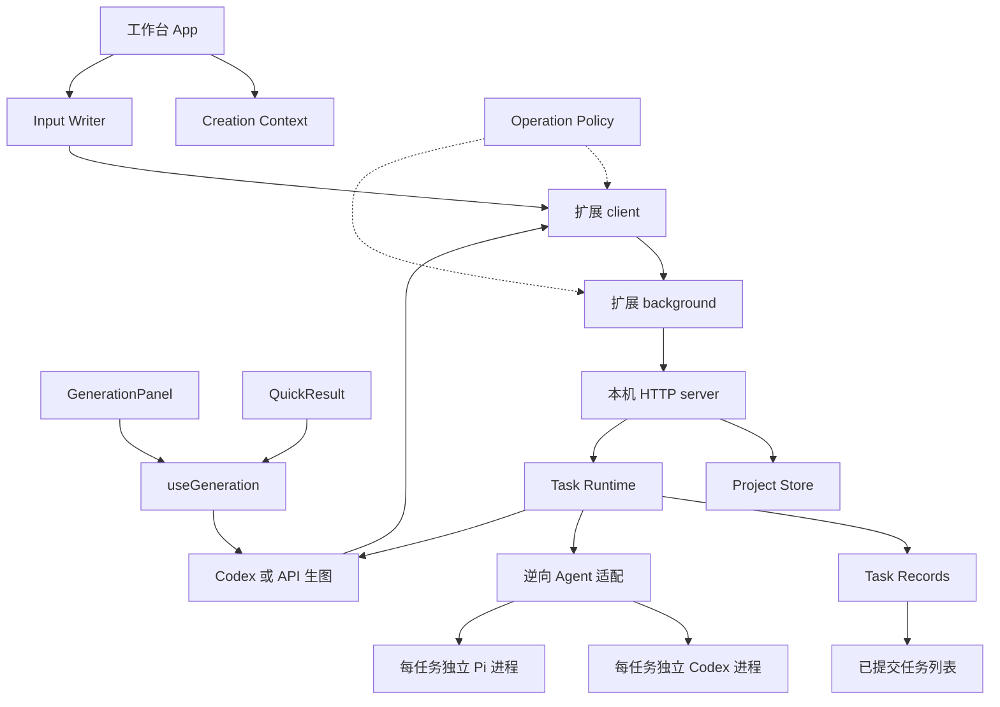

# Reframe 架构与维护边界

Reframe 保持扩展 UI、扩展后台、本机 bridge 三个执行环境。共享业务规则集中在明确的 module 中，界面保留导航、布局与效果，HTTP 入口保留鉴权、参数解析与执行装配。领域词汇见 [GLOSSARY.md](../../GLOSSARY.md)，产品约束见 [AGENTS.md](../AGENTS.md)。

## 创作上下文

`lib/creation-context.ts` 的 interface 包括 reducer、上下文解析、快捷草稿过滤和输入 writer。它集中保存此前散落在 App 闭包中的优先级与失效规则，减少跨函数追踪状态的成本。

- 草稿以 `projectId:mode:version` 隔离，优先于对应当前输入与历史快照。当前输入仅用于当前版本或尚未逆向的输入；历史版本使用当次参考图，缺图不回退到别的版本。
- 外部较新 `inputRevision` 使项目工作输入草稿失效；本地保存只清理对应当前草稿，保留历史草稿。提示词正文编辑继续由独立草稿管理。
- `createInputWriter` 同步防重入，发送输入 revision，并在响应到达时核对上下文对象身份和导航 revision。检查通过与 commit 回调在同一段同步执行中完成，不能在两者间再插入 `await`。
- writer 丢弃旧响应只影响界面接收。服务端可能已经成功保存；后续重新读取项目按服务端 revision 恢复，不伪造撤销。

App 仍拥有页面导航、提醒、弹层、轮询和效果，不把所有 UI 状态塞入领域 reducer。QuickWorkspace 沿用自己的初始化与交接编排，输入草稿过滤复用同一规则。

## 共享生图行为

`lib/generation-session.ts` 提供 `generationReadiness` 和 `createGenerationSession`；`lib/use-generation.ts` 是 React adapter。工作台和快捷结果共用资格判断、提交参数、取消、同步防重入、失败状态、图片及参考快照读取。

每个挂载中的提示词版本有自己的生图会话。图片读取用序号丢弃迟到结果；版本离开后不再更新其展示，但已经提交的请求仍通过原版本 onUpdate 更新数据、onRequestState 收尾原抽屉。清理当前历史图片定位属于独立 onViewUpdate，仅允许原挂载生命周期、创作上下文及导航轮次仍有效时执行，离开再返回也不能接收旧请求的视图动作。关闭界面不取消本机任务。实际布局、抽屉、语言、尺寸控件与图片操作留在各自组件中。

这个 seam 有两个实际 UI adapter，改动一处即可覆盖两端；不引入通用表单框架或全局事件总线。

## 逆向 Agent

`bridge/agent.mjs` 统一构造 Alchemy 输入、图片顺序和输出合同，再按提交时的 `modelSettings.agent` 分派 Codex 或 Pi。缺少旧字段按 Codex 解释，未知 Agent 明确失败。`bridge/agents.mjs` 持久化逆向选择，`models.mjs` 复用同一验证与保存流程，将 Codex 和 Pi 模型分别存入配置文件；切换不改动全局 CLI 设置或凭据。

`bridge/pi-agent.mjs` 管理 Pi 子进程协议、模型目录、错误与取消；`pi-extension.mjs` 只开放本次图片取证及技能资料读取。图片操作复用 `inspection.mjs`，没有第二套裁切规则。Pi 不提供 Codex 的 OS sandbox，因此通过禁用默认工具、个人扩展和上下文文件限制模型可调用能力；该限制不声称隔离 CLI 自身或模型服务。

任务和排队批次冻结逆向 Agent/provider/model/推理参数；自动生图另冻结所选生图渠道、模型及 API 配置。两阶段仍由既有 Task Runtime 和 Batch Store 调度，取消、保存失败及重启恢复使用原规则。会话正文读取独立使用 Codex，只把既有显式快照交给所选逆向 Agent。

CLI 管理由 `cli.mjs` 与 `pi-cli.mjs` 分别验证安装来源，复用固定参数的子进程执行器。`/cli/*?agent=codex|pi` 显式指定管理目标；省略时兼容 Codex。安装更新与任务、模型验证全局互斥，完成后只清除对应 Agent 的模型信任；Codex 更新还复查兼容性并重建会话读取器。

Pi 新安装使用固定官方 npm 包、私有暂存目录和禁用生命周期脚本的安装参数；验证成功后原子替换当前安装指针。外部 npm 安装先核对包身份、真实入口和运行时；具备原生自更新能力时调用原 CLI 的固定 `update --self --no-approve`，由 Pi 从自身安装位置确定原 prefix，不把资源包更新当作 CLI 升级。不支持原生自更新时仍仅允许已验证 npm manager 的原 prefix 更新。更新后复检路径、版本与 Reframe 接口；失败或取消时，已发生部分替换也须清除旧模型信任。App 或无法确认来源的安装不自动覆盖。管理操作不接受任意命令或路径，也不读取或复制登录凭据。设置中的管理目标独立于已保存的逆向 Agent；旧 `section=cli` 和 Pi 恢复入口只定位对应管理区域。

## 生图渠道

Magpie 是新增 API 网关入口，`magpie.mjs` 只负责本机地址规范化、应用身份与只读目录，不实现厂商路由。`/image-models` 仅供扩展页面连接：验证 `/api/hello`，读取 `/v1/models`，筛选 kind=image 且 output 包含 image，返回有限安全字段。禁止远程地址、地址内凭据与重定向；目录大小和耗时有界。健康状态与受理共用配置完整性规则，Magpie 无需供应商 Key；受理时确认完整模型仍在生图目录，失败不自动选其他模型。

Magpie 文生图使用 Images JSON generations，附图使用 multipart edits，沿提示词版本的图序重复发送 `image[]`，固定 `n=1`。目录 input 元数据不作为 edits 的硬门禁，也不代表真实附图能力已验证。手动、连续和批量均固定受理时的渠道、模型、素材与尺寸。`imageSize` 独立于旧 `aspectRatio`，保存正有限的用户请求意图；共享 `lib/image-size.mjs` 按明确模型族计算 `submittedImageSize`（null 表示默认）及 `sizeRule`。GPT Image 2/2.5 Flare/Sunburst 在合法格点中综合对数比例与面积距离取最小值；Gemini 限于网关十比例并以像素载体传递，未知模型和无效数值使用默认。UI 预览与受理共用规则，后端不信任客户端提交的归一化字段；连续流程和批次在受理时冻结并跨阶段复用，历史及旧在途任务不重算。实际网络请求只使用冻结的提交值，默认省略 size；拒绝跨渠道混用字段。历史保留请求模型、可选网关返回模型、sizeMode（gateway-default/explicit）、请求 imageSize、submittedImageSize/sizeRule 与解码得到的实际 outputSize，不转换、裁剪或拉伸输出。请求复用受限 URL 下载和严格图片解码。连接成功不等于真实生图验证；具体模型的附图、尺寸和权限需要实测。既有直连配置不迁移、不删除，已受理任务按原快照继续。取消只保证 Reframe 终态与停止后续操作，不保证上游撤单或免计费。

`generation-output.mjs` 在图片与任务记录均成功提交前保留模型返回的字节；写图片前先原子保存 `generation-outputs/<generationId>.json`，独立关联任务、图片 hash 与输出元数据。即使终态和失败补写连续失败，启动也先按关联恢复 resultSavePending，再回收图片；所有回收入口保护关联引用。恢复索引损坏或所指任务文件损坏时停止启动并保留原件；已取消、已删除或已完成任务不复活。图片写入或终态保存失败，任务为 failed；`POST /jobs/:jobId/generations/:generationId/save` 只重试保存原输出，不调用模型、不新增 generation。失败不清除恢复项，保存成功、取消或删除后释放；尚无磁盘图片时仅服务内存可恢复。任务记录存在未提交写入时也禁止图片回收。

`bridge/image-settings.mjs` 原子保存渠道与各 API 配置；扩展专用 `/image-settings` 仅返回非敏感字段及密钥存在状态。`image-api.mjs` 处理 OpenAI Images 和 Gemini generateContent 协议、有序附图、比例适配、受限下载及取消；Codex 路径继续使用原 generator。完整复刻只发送提示词，其余模式沿用任务的图片顺序与分工。失败不回退其他渠道、不自动重试。

手动、连续及批次任务在受理时冻结生图配置。凭据只保存在私有设置文件和在途内存快照，不进入任务、批次或历史响应；批次终结及服务关闭清理快照。历史保留渠道、地址和模型；重启沿既有规则终结中断批次，不读取当前密钥继续旧请求。

Codex 内置生图不依赖插件中的文字模型选择或验证。`generation.mjs` 通过只读 RPC 读取 CLI 执行上下文，`model-context.mjs` 优先采用有效配置中的显式模型；缺省时只接受完整目录中唯一标记的默认模型，不任取首项，也不要求显式自定义模型出现在目录。受理时冻结模型、提供方、推理强度和账号上下文，不启动文字探针；执行前继续检查账号/提供方/CLI 是否改变以及内置生图能力。明确的模型与推理强度沿用原快照；原快照未指定推理强度时，若 CLI 后来新增强度配置，则拒绝继续，避免隐式采用新值。解析中的请求断开会取消 RPC，迟到结果不能启动任务。生图失败不撤销逆向文字模型的验证状态；逆向仍保留原验证流程。

`/health.generationReady` 只表示渠道配置允许提交，不表示模型已验证或真实生图可用。Codex 返回 `true`、`generationModel: null`，轮询不为生图解析启动 RPC；API 仍检查模型与密钥完整性。内置生图执行模型只用于内部快照与任务记录，不在渠道设置展示。配置/账号/能力错误明确标记“Codex 内置生图”并返回 `recovery: cli`，由设置恢复入口引导检查 Codex；不引导验证当前逆向 Agent 的文字模型。

## 运行与持久化

`bridge/task-runtime.mjs` 统一逆向和生图的执行占用及完成路径。`reserve` 为每个任务保留独立 AbortController；`cancel` 标记取消、发出信号并保存，直到 `run` 的最终保存结束才释放占用。跨项目并行不共享取消信号。读取占用和运行占用都参与维护操作的忙碌判断。

`bridge/task-records.mjs` 拥有任务 JSON 的加载、提交与恢复：

1. 调用 save 时冻结 JSON 快照，串行写临时文件，再原子 rename。
2. rename 成功后执行 onCommit，任务 feed 使用已提交快照；项目索引可用实时进度做摘要失效。
3. 最近保存时间（含完成保存）写在任务的 `updatedAt`，项目摘要兼容旧记录的 `createdAt`。任务完成不再依赖第二次项目元数据 touch，避免任务已落盘而 feed 未发布的部分成功状态。
4. 重启时将中断的逆向及生图先保存为失败，再对外发布；恢复保存失败会中止启动。损坏记录不会掩盖其他可恢复任务，图片回收仍保守阻断。
5. 未提交保存存在时 `canCollect` 为 false，防止回收尚待写入引用的资源。保存恢复成功后才允许回收；执行终态保存失败会报告保存失败并重试记录。

这是单机进程中的有序提交，不声称提供跨文件数据库事务或断电级 fsync 保证。项目编辑继续使用既有原子 JSON 与删除 journal；输入 CAS 在 Project Store 编辑队列内部再次校验，避免排队前两次校验都通过。项目、图片与任务记录各自已有的恢复方式保持兼容。

## 通信与预览

`lib/operation-policy.ts` 是 UI 请求来源和 transport 的共同目录，供 client、background、bridge 超时与 preview 使用。慢输入请求和会话请求使用 port，后台仍验证扩展 ID、URL、frame 及具体消息参数；会话读取仅允许扩展页面。为了旧页面兼容，保留允许操作的单次消息处理及 callback 响应。

[`agent-tool/preview.mjs`](../../agent-tool/preview.mjs) 是示例 adapter，运行实际构建的 UI，模拟外部环境。它复用请求目录，正文索引损坏时标题搜索回退与生产模块有契约测试。它仍模拟任务、图片和项目写入，不是第二个生产存储实现，也不能证明真实扩展权限、跨域取图或模型调用可用。

## 测试与修改路径

先在插件目录执行 `npm run build`、`npm run compile`、`npm test`。扩展消息测试依赖当前构建，不能跳过 build 使用旧 bundle。

| 改动 | 主要验证 interface |
| --- | --- |
| 输入优先级、历史与草稿 | `project-selection.test.mjs`、`reference-upload.test.mjs` 的实际 creation module；`creation-context.browser.js` 验证 App 接线 |
| 两端生图行为 | `generation-session.test.mjs`，工作台 `generation-actions.browser.js`，快捷界面提交/取消 |
| 执行、取消、保存失败与重启 | `task-runtime.test.mjs`、`task-records.test.mjs`，现有 server/storage 集成测试 |
| CAS、空输入、旧记录 | `project-inputs.test.mjs` 与项目恢复测试 |
| 发送方及慢请求 | `operation-policy.test.mjs` 与构建后的 `extension.test.mjs` |
| 示例与生产一致性 | `preview-contract.test.mjs`：运行实际 preview 脚本并与生产检索契约对照 |

测试优先通过真实 interface 注入 request、execute 或文件系统故障，验证可观察行为。已有部分 App 导航编排仍通过 AST 提取测试；随对应职责迁移逐步替换，不为测试重新暴露私有闭包。预览也不泛化成适配器框架；出现第二个真实实现和实际分歧后再深化 seam。

输入保存浏览器回归：启动 preview 后访问 `/workspace.html?state=alignment&mode=recreate&inputSaveDelay=1800&creationContextRegression=mode`；末项可改 `version`、`project` 或 `failure`（失败场景另加 `&swap=failed`）。使用真实画布上传及外部提醒导航，顶部应显示 PASS。保存期间普通导航控件禁用，测试不绕过 disabled。主操作回归入口为 `/workspace.html?state=alignment&mode=recreate&generationActionsRegression=1&generationDelay=60000&generationStartDelay=200`。

保留单机 JSON、不可变图片资产、任务独立 Codex 进程、会话 Worker 与只读 RPC 政策。本轮不更换数据库、不拆网络服务、不改变五模式产品语义。

## 自动连接

`bridge/connection.mjs` 根据 Chromium 的 unpacked ID 规则确定当前安装标准输出目录的扩展 Origin，合并安装配置中显式批准的 `ALCHEMY_EXTENSION_ID`。服务的 `POST /connection` 校验精确 Origin、Host、JSON 空请求及无查询参数后返回既有 token，并禁止缓存；其他业务接口保持 Bearer 认证。原 token、配置和项目数据不重置，普通网页和未知扩展不能自动注册。

扩展后台按业务需要连接，并把凭据仅保存在 trusted local storage。并发请求共用一次握手，偏好写入串行合并，避免连接覆盖模式选择；收到明确 401 时最多恢复一次，网络失败和业务错误不重放请求。界面可见时轮询健康状态，首次未配对也会连接，关闭或切换设置不改变进行中的任务。Codex 与 Pi 共用此连接，安装/登录/模型验证仍由各自渠道管理；连接不依赖 Codex 技能或模型就绪。
